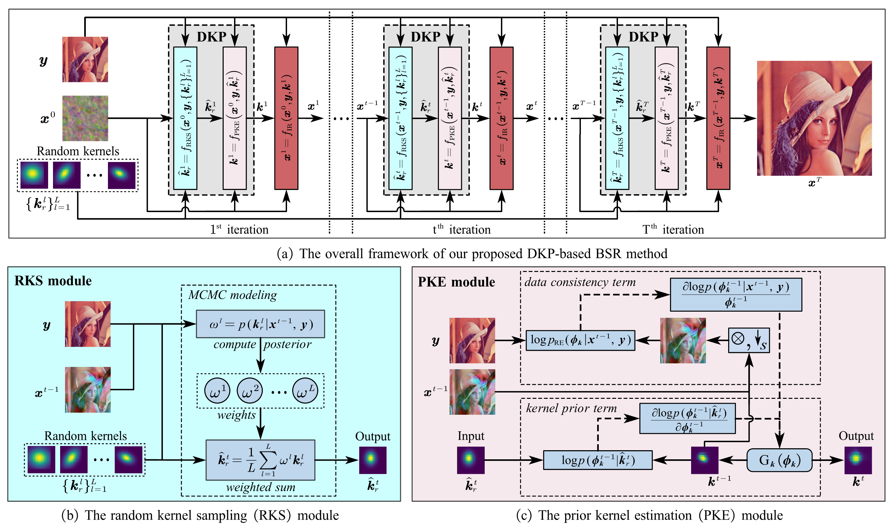

# A Dynamic Kernel Prior Model for Unsupervised Blind Image Super-Resolution (DKP), CVPR2024

The origin repo is [Here](https://github.com/XYLGroup/DKP). We improve the code based on DIPDKP provided by paper.

><p align="center">
  > 
</p>

## Requirements
- pip install numpy torch blobfile tqdm pyYaml pillow    # e.g. torch 1.7.1+cu110.

---

## Data Preparation for DIPDKP
First of all, you need put the image in DIPDKP/data/dataset/folder/HR
```bash
cd DIPDKP/data
python prepare_dataset.py --model DIPDKP --sf 2 --dataset folder # for DIPDKP gaussian blur
python prepare_dataset.py --model=DIPDKP-motion --sf=2 --dataset=idol # for DIPDKP motion blur
```

If it is limited by GPU, you can run down.py to crop the image.

## Run DIPDKP

You can run DIPDKP and compare with gt by running

```bash
cd DIPDKP
cd DIPDKP
python main.py --dataset=idol --model=DIPDKP-motion --sf=2
```

Pay attention that you have already prepared the dataset. You can check /DIPDKP/data/datasets/idol/HR , /DIPDKP/data/datasets/idol/DIPDKP-motion_gt_k_x2 and /DIPDKP/data/datasets/idol/HR/DIPDKP-motion_lr_x2 exist.

## Check the result
All of the results are saved in /DIPDKP/data/log_DIPDKP, you can check the results.
